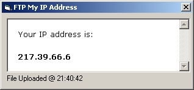



## FTPmyIP

### Description

I've wanted this for ages... just run the program and it will grab your IP address by visiting "http://www.facultyof1000.com/whatsmyip.asp", saves this as "c:\myip.txt" then uploads it to your web site. At present all ftp and filename details are hard coded in as it's only for me, though I'll probably add ini function to it. Thanks to Chris Eastwood for the ftp bit.
 
### More Info
 

             |
---                |---
**Submitted On**   |2002-05-15 17:19:42
**By**             |[Jon Webb](https://github.com/Planet-Source-Code/PSCIndex/blob/master/ByAuthor/jon-webb.md)
**Level**          |Intermediate
**User Rating**    |5.0 (20 globes from 4 users)
**Compatibility**  |VB 6\.0
**Category**       |[Internet/ HTML](https://github.com/Planet-Source-Code/PSCIndex/blob/master/ByCategory/internet-html__1-34.md)
**World**          |[Visual Basic](https://github.com/Planet-Source-Code/PSCIndex/blob/master/ByWorld/visual-basic.md)
**Archive File**   |[FTPmyIP1362119252002\.zip](https://github.com/Planet-Source-Code/jon-webb-ftpmyip__1-39269/archive/master.zip)

